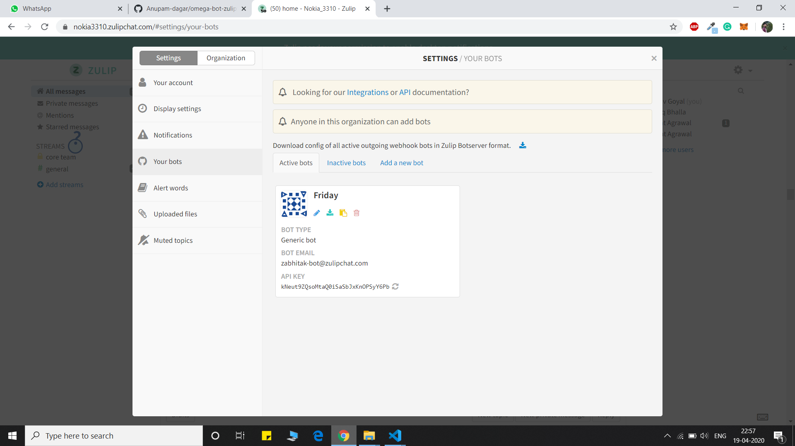
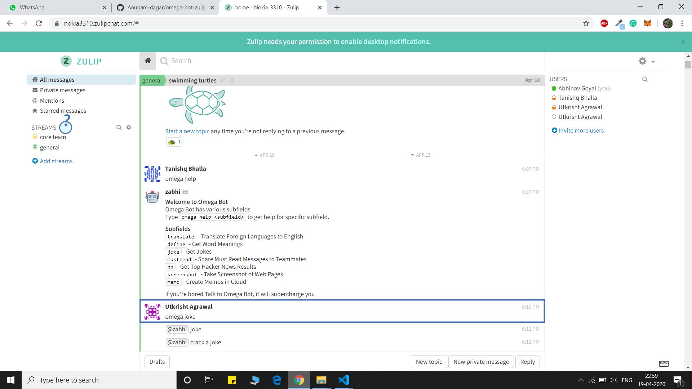
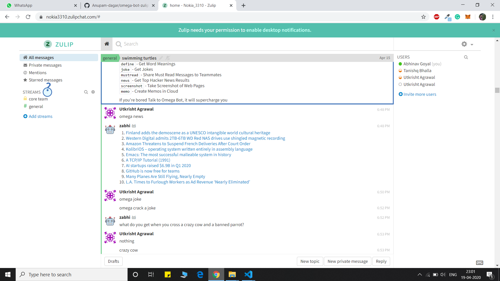
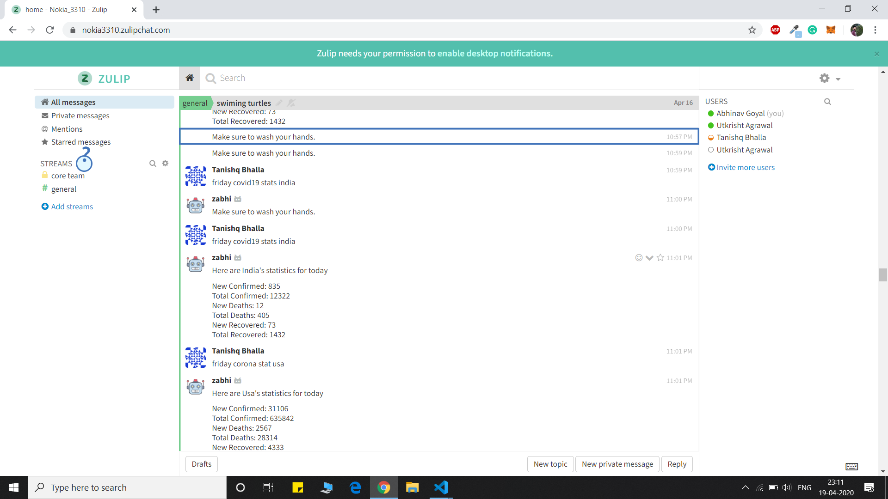

# Friday-Zulip-Bot
ZulipBot for HackOn

# Welcome to Friday!
## Team Nokia3310 in HackON
!
## **Friday-Bot** is a zulip chatbot   


# Instructions to run locally:
1. [Create a Zulip Realm](https://zulip.com/create_realm/)
2. Goto to settings and create a new generic bot named 'Friday'. (Settings can be found in dropdown of gear icon present in top right corner of zulip realm)
3. Download the zuliprc file for your bot and place it in your home directory as '.zuliprc'.
  
4. Install all the requirements using ``` pip install -r requirements.txt ```
5. In ``` bot.py ``` , change site in ``` self.client = zulip.Client(site="https://chunkzz.zulipchat.com/api/") ``` to url of your created zulip realm.Do the same for ``` BOT_MAIL ``` variable.  
6. Run ``` bot.py ``` using python 3. ``` python3 bot.py ```
7. Head over to your created zulip realm and start using the bot.

# Features

friday-Bot can :
>

>* Get top news
>* Crack a joke
>* Motivates you with quotes
>* Have a nice chat with friday

## How to use?

 


###  News:
Get top 10 stories in no time in your Zulip server.  
`friday news`  

    

###  News:
Get the covid 19 statistics.  
`friday covid19 stats india`  

  


###  Motivate:
Motivate is here to help you with motivational quotes when you are down :smile:  

```friday motivate```  

  


###  Joke:
This integration cracks some really good as well as lame jokes !. 

`friday joke`  


Our Zulip chat Bot is integrated with a timer that reverts a message “Wash your hands, put up a mask” after a frequent interval of time, show news related to COVID globally as well as for a specific country, can go through COVID statistics globally and for each country too. You can ask COVID related queries from the Bot as well, i.e., How can I be safe from CoronaVirus and the Bot will answer for this. We have added some features like jokes to just make you relax, motivation section to make everyone contribute their best in the alarming condition when the nation is suffering.

Features of Bot:
Latest updates of Covid19 related news.
Updated statistics of Covid19 cases globally and locally.
Precaution techniques reminder.
Covid19 related queries.


## Contributors
* [Tanishq Bhalla](https://github.com/Tanishq457)  
* [Abhinav Goyal](https://github.com/zabhitak)  
* [Utkrisht Agrawal](https://github.com/gutku10)  
